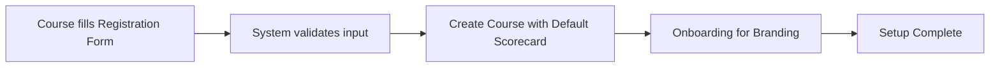
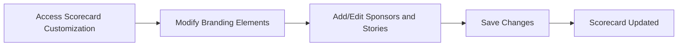
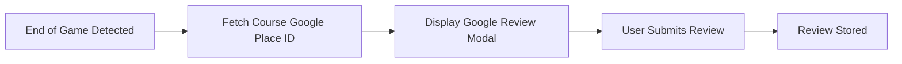
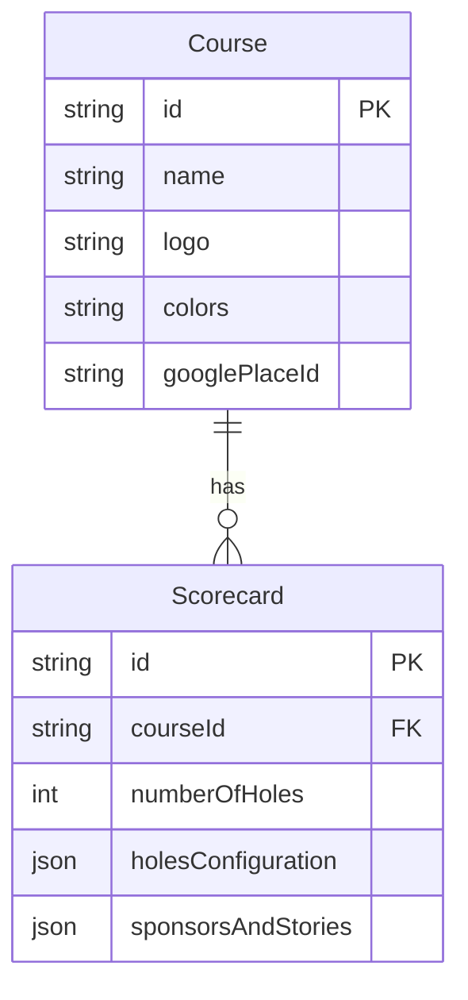

# Architecture Overview

This document provides an in-depth overview of the system architecture for the Mini Golf Scorecard App. The app is designed to empower golf courses to manage customizable digital scorecards that include branding, sponsorships, and user interaction features.

## Table of Contents

- [Introduction](#introduction)
- [System Components](#system-components)
- [User Flows](#user-flows)
- [Data Model](#data-model)
- [Integration with External Services](#integration-with-external-services)
- [Conclusion](#conclusion)

## Introduction

The Mini Golf Scorecard App is a web-based application that allows golf courses to create and manage digital scorecards. These scorecards are customizable to align with each course's branding and can include elements such as logos, colors, sponsors, and stories specific to each hole. The app also facilitates the collection of Google Reviews to enhance course visibility and feedback.

## System Components

The architecture is divided into the following primary components:

- **Frontend**: A single-page application built with modern web technologies to provide a rich user interface for course registration, scorecard management, and branding customization.
- **Backend**: A lightweight service managing course data, scorecards, and integrates with Google Places for review collection.
- **Database**: A relational database storing course details, scorecard configurations, and sponsor information.

## User Flows

The user interactions with the app can be described as follows:

### Course Registration Flow

### Scorecard Customization Flow

### Google Review Collection Flow

## Data Model

The following schema illustrates the high-level data model used in the application:

## Integration with External Services

The app does not integrate with external golf course databases. Instead, it uses Google Places API to fetch and link the Google Place ID for collecting reviews. This integration is essential for the seamless collection of feedback at the end of a game.

## Conclusion

The Mini Golf Scorecard App aims to digitize the traditional scorecard experience while providing customization options unique to each course's brand. By allowing courses to manage their own scorecards, sponsors, and gather reviews, the app enhances the marketing and user experience while maintaining simplicity and ease of use.
