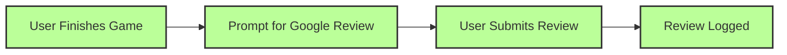

# Database Structure and Design

This document outlines the database structure and design for the mini golf scorecard web application. The app enables courses to manage and customize their scorecards, including branding elements, rules, and sponsor stories for each hole. This document includes entity definitions, relationships, and key design considerations.

## Database Schema Overview

The database will be structured to support the main functionalities, which include course management, scorecard configuration, and sponsor/story integration. Below are the primary entities and their relationships:

### Entity Definitions

- **Course**
  - Stores essential course details and branding elements.
  - Attributes: `id`, `name`, `logo`, `colors`, `typography`, `header_image`, `google_place_id`.

- **Scorecard**
  - Contains information about the scorecards associated with a course.
  - Attributes: `id`, `course_id`, `number_of_holes`.

- **Hole**
  - Represents each individual hole on a scorecard.
  - Attributes: `id`, `scorecard_id`, `hole_number`, `par`.

- **Sponsor**
  - Information about sponsors that can be associated with holes.
  - Attributes: `id`, `name`, `logo`, `url`.

- **Story**
  - Contains stories or historical information linked to holes.
  - Attributes: `id`, `title`, `content`.

- **HoleSponsorStory**
  - A linking table for managing many-to-many relationships between holes, sponsors, and stories.
  - Attributes: `hole_id`, `sponsor_id`, `story_id`.

### Relationships

- A `Course` can have one or many `Scorecards`.
- A `Scorecard` consists of multiple `Holes`.
- Each `Hole` can have multiple `Sponsors` and `Stories`.
- `Sponsor` and `Story` can be linked to multiple `Holes` through the `HoleSponsorStory` table.

## ER Diagram

The following Mermaid diagram illustrates the Entity-Relationship (ER) model for the database:

```mermaid
graph LR;
  Course --|> Scorecard;
  Scorecard --|> Hole;
  Hole --o|> HoleSponsorStory;
  Sponsor --o|> HoleSponsorStory;
  Story --o|> HoleSponsorStory;

  classDef entity fill:#f9f,stroke:#333,stroke-width:2px;
  class Course,Scorecard,Hole,Sponsor,Story,HoleSponsorStory entity;
  
  Course[Course] --> Scorecard[Scorecard];
  Scorecard --> Hole[Hole];
  Hole --> HoleSponsorStory["HoleSponsorStory"];
  Sponsor --> HoleSponsorStory;
  Story --> HoleSponsorStory;
```

## Course Registration and Configuration

### Course Registration

1. **Registration Screen**: Courses register through a dedicated registration screen where they create their profile by providing basic details including course name, logo, and location.

### Scorecard Configuration

- **Default Scorecard**: Upon registration, a default scorecard with 18 holes is generated.
- **Brand Customization**: Courses configure their scorecards by setting logos, colors, and typography.
- **Rule Setting**: Courses can set text-based rules for their scorecards, which will appear in a modal.
- **Sponsor/Story Integration**: Courses can add sponsors or stories to each hole through a configurable interface.

## Google Reviews Integration

One of the primary goals of the app is to collect Google Reviews. The registration process requires the user to provide the course's address to fetch the Google Place ID, which is then used to prompt users for reviews upon scorecard completion.

### Google Reviews Flow



## Conclusion

This database design aims to provide a robust foundation for managing course-specific scorecards, branding elements, and marketing opportunities through sponsor stories. By integrating Google Reviews, courses can enhance their engagement with golfers, thereby improving user experience and course visibility.
```
