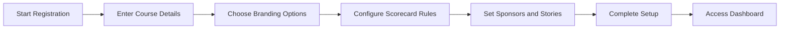
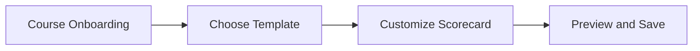

# Course Registration System

This document outlines the architecture and workflows for the registration system within the mini golf scorecard app. The app allows courses to manage their own scorecards, customize branding, and more.

## Overview

The registration system enables golf courses to sign up, customize their profiles, and manage their digital scorecards. This system is a vital component of the app, facilitating course-specific branding and configuration.

## Registration Workflow

Courses will utilize a web-based registration system consisting of several key steps for optimal setup and branding.

### Registration Flow



### Step Details

1. **Enter Course Details**
   - Courses input essential information including name, location, and contact details.
   - Automatic linking to Google Place by inputting the course's address to capture reviews later.

2. **Choose Branding Options**
   - Courses can upload logo, select colors, typography, and add a header image to reflect their brand identity.

3. **Configure Scorecard Rules**
   - Custom text-based rules can be added, which will be displayed in modals during gameplay.

4. **Set Sponsors and Stories**
   - Define a list of sponsors or conceptual stories per hole using a repeater field for dynamic content management.

5. **Complete Setup**
   - Verification of all inputs and finalizing registration for dashboard access.

6. **Access Dashboard**
   - Courses can start managing their scorecards and other app features through their personalized dashboard.

## Scorecard Customization

Courses can utilize predefined scorecard templates and configure them based on their distinct needs.



### Customization Features

- **Predefined Templates:** Initiating with standard 18-hole templates.
- **Hole Configuration:** Add or edit holes, assign numbers, associate sponsors or stories.
- **Visual Adjustments:** Immediate preview of changes to ensure synchronization with branding.

## Integration and Features

### Google Reviews Integration

At the completion of a round, players will be prompted to leave a Google Review for the course using the linked Google Place ID.

## Security and Data

- **Data Privacy:** No personal user accounts, ensuring focus on course data and preferences.
- **Data Management:** All course data stored securely with options for updates and modifications by the course admins.

## Future Enhancements

- Integration with other potential third-party marketing or analytics tools.
- Expansion to mobile platforms depending on user feedback and demand.

## Conclusion

This registration system is designed to provide a seamless experience for course managers, enhancing the digitization of scorecards and promoting their courses effectively.
```
