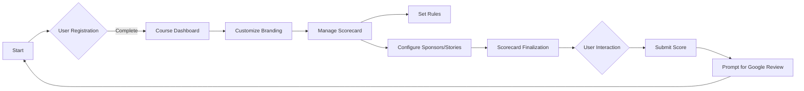
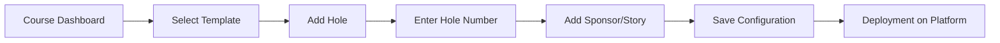
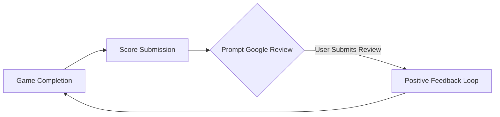

# System Overview

This document provides a comprehensive overview of the system architecture for the Mini Golf Scorecard App. The app is designed to serve the needs of golf courses by offering customizable digital scorecards. It primarily targets course management, allowing courses to manage their branding and configurations while collecting user engagement metrics through Google Reviews.

## Platform

The Mini Golf Scorecard App is a **web-based application** designed to ensure compatibility across devices with internet access.

## User Roles

### Course Administrator
- **Description**: Course Administrators are responsible for managing the course's digital presence through the app.
- **Responsibilities**:
  - Register and create course profiles.
  - Customize scorecards with branding elements.
  - Configure rules, sponsors, and stories.

## Key Features

### Registration and Profile Management
- Course Administrators can register and create profiles with a registration screen.
- Courses manage their branding elements including logos, colors, typography, and header images.

### Scorecard Customization
- Pre-defined templates with 18 holes are provided by default.
- Customization options for holes, including sponsors and story configurations, using a repeater field mechanism.

### Course Branding Elements
- **Logos**: Upload and display course logos.
- **Colors**: Choose and apply custom color schemes for branding.
- **Typography**: Adjust text styles and fonts.
- **Header Image**: Customize the header image of the scorecard display.

### Rule Configuration
- Administrators can set rules, which are displayed in a modal format.
- Text-based rules with no specific restrictions imposed by the app.

### Engagement and Review Collection
- Collection of Google Reviews initiated through an in-game modal after score submission.
- Integration with Google Places ID to link course location for review purposes.

## Architecture Diagram

Below is a representation of the system's architecture, illustrating the flow from user registration to the final user interaction within the app.

## Interaction Flow

### Scorecard Configuration

Scorecard configuration allows course administrators to create a comprehensive digital scorecard containing individualized holes, rules, sponsors, and stories.

### User Score Submission

Once a game is completed, users are prompted to submit their scores and are encouraged to provide feedback, thereby enhancing the course's online presence through Google Reviews.

---

This systematic overview serves to aid in the development, testing, and deployment phases of the Mini Golf Scorecard App, ensuring alignment with the project goals and user needs.
