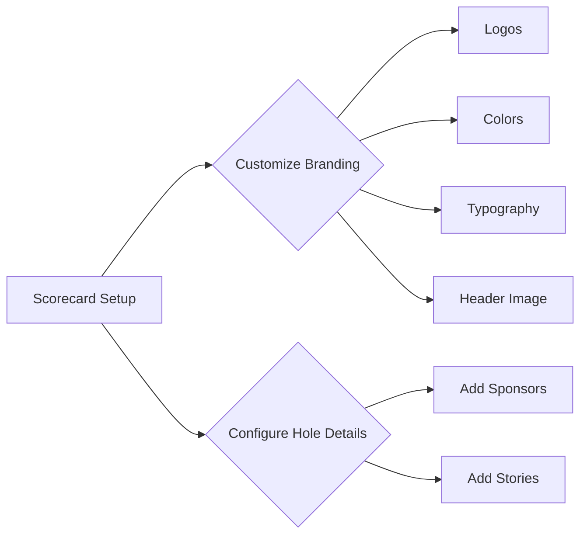

# Customization Options

The mini golf scorecard app provides various customization options for courses to reflect their unique branding and enhance the overall experience. This document details the customization features available, focusing on logos, colors, branding elements, and configuration for sponsors and stories on each hole.

## Branding Elements Customization

Courses can tailor their digital scorecards by customizing the following elements:

### Logos

- **Upload and Manage Logos**: Courses can upload their logos during the onboarding flow. These logos will be displayed prominently on the scorecards.
- **Logo Format**: Supported formats include PNG and JPEG. Recommended size is 200x200 pixels for optimal display clarity.

### Colors

- **Primary and Secondary Colors**: Courses can choose their primary and secondary colors during the setup process. These colors will be used throughout the scorecard design, ensuring a cohesive look with the course's physical branding.
- **Color Picker Tool**: A user-friendly color picker tool is available for easy customization.

### Typography

- **Font Styles and Sizes**: Although typography options are more limited, courses can select from a set of standard fonts and customize sizes to match their branding needs.

### Header Image

- **Custom Header Image**: Courses have the option to upload a header image that appears at the top of the scorecard. This can enhance the visual impact and align with the course's branding strategies.

## Configuring Sponsors and Stories

Each hole in the mini golf course can have unique sponsors, stories, or promotional content configured as follows:

### Hole-Specific Sponsors

- **Adding Sponsors**: In the scorecard setup, courses can attach sponsors to specific holes. This is done through a repeater field allowing multiple sponsors per hole.
- **Sponsor Details**: Information such as sponsor name, logo, and a brief description can be included.

### Stories and Descriptions

- **Hole Stories**: Courses can add descriptive stories or historical notes about each hole. This feature enhances player engagement and connection to the course.



## General Customization Flow

Courses will follow an onboarding flow that guides them through setting up their digital scorecard, ensuring all branding and hole configurations are captured accurately.

### Onboarding Flow

1. **Registration**: Course representatives create an account and enter primary details.
2. **Initial Setup**:
   - Upload Logo
   - Choose Primary and Secondary Colors
   - Select Fonts and Add Header Image
3. **Hole Configuration**:
   - Access the list of holes (default 18 holes).
   - For each hole, add sponsors and any associated stories.
4. **Completion**: Review and confirm the setup. The scorecard is now ready to be used and linked with their Google Place ID for collecting reviews post-game.


## Conclusion

These customization options empower courses to reflect their branding effectively on the digital scorecards. By facilitating easy updates to logos and branding elements, coupled with personalized hole-specific content, the courses can enhance both the aesthetics and the user experience. This not only digitizes the scoring process but also reinforces the course's brand identity among players.
```
