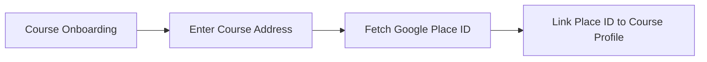
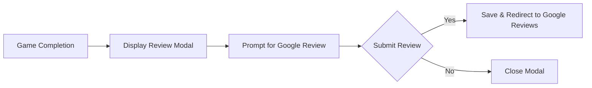
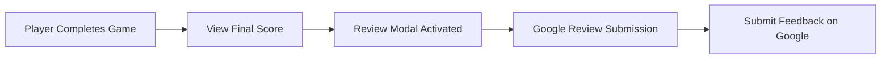

# Google Reviews Integration in the Mini Golf Scorecard App

## Overview

The Google Reviews integration in the mini golf scorecard app is a pivotal feature that enhances golf course marketing efforts by collecting valuable feedback from players. This integration allows golf courses to link their location with their Google Place ID, prompting players to leave a review upon completing their round of mini golf. Below is a comprehensive explanation of how this integration operates within the app.

## How Google Reviews Integration Works

The integration is seamlessly woven into the onboarding and game completion processes, ensuring that course operators can effortlessly collect reviews. Here’s how it all works:

### Step 1: Course Onboarding

During the onboarding process, course managers will input the physical address of the golf course, which is then used to fetch the Google Place ID automatically. This ID uniquely identifies the location on Google Maps and is crucial for linking the course to its Google Reviews page.



### Step 2: Game Completion

Upon completion of a mini golf game, players will be prompted with a modal window inviting them to leave a Google Review. This modal appears as a part of the natural flow of the app, ensuring maximum engagement from players.



## Technical Details

- **Google Place API Integration**: The app utilizes the Google Place API to retrieve the Google Place ID based on the course address. This ID is essential for directing reviews to the appropriate location on Google Maps.

- **Modal Design**: The review prompt is a user-friendly modal integrated into the game completion workflow. It ensures that after players finish their game and view their scores, they are encouraged to leave a review while the experience is still fresh in their memory.

- **Data Flow**: The integration does not store the content of the reviews within the app. Instead, it redirects users to the Google Reviews page for the authenticated submission of their feedback.

### User Flow Diagram

Here is a simple diagram to illustrate the user flow for the Google Reviews integration within the app:



## Benefits

- **Enhanced Visibility**: Collecting reviews boosts the visibility of golf courses on Google Maps, potentially attracting more players.
- **Authentic Feedback**: Reviews provide genuine feedback on the golfing experience, aiding course owners in improving their offerings.
- **Seamless User Experience**: The integration is designed to be non-intrusive and aligned with the app's existing user flow, ensuring a smooth experience.

## Conclusion

The Google Reviews integration within the mini golf scorecard app not only aids in enhancing a golf course's digital presence but also strengthens its ability to gather meaningful player feedback. By embedding this function into the core features of the app, golf courses can effortlessly manage and grow their online reputation while focusing on delivering an exceptional mini golf experience.
```
