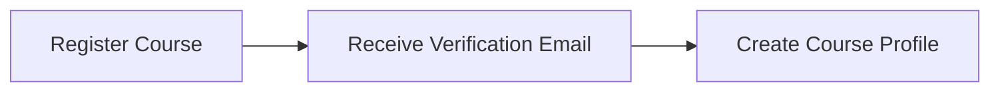
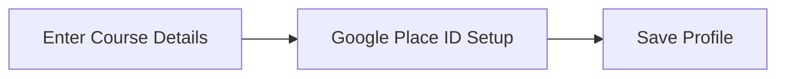
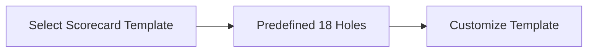
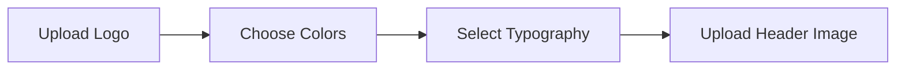
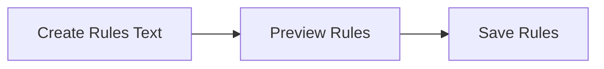
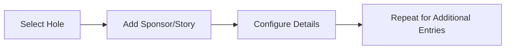
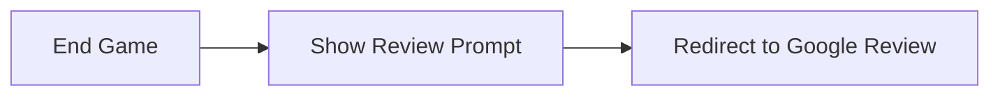

# Onboarding Process

Welcome to the Mini Golf Scorecard App! This guide walks you through the onboarding process, helping you set up your golf course's digital scorecard with ease. During onboarding, you'll be able to customize your scorecard and integrate essential branding features to enhance your course's digital presence.

## Onboarding Flow

During the onboarding process, course managers will follow these steps to configure their scorecards and capture their brand essence.

### 1. Registration

Start by registering your course on the platform. Once registered, you'll gain access to the course profile management and customization interface.



### 2. Course Profile Setup

Fill in your course's details such as name, address, and contact information. You will also be able to set your Google Place ID to solicit reviews seamlessly.



### 3. Scorecard Template Selection

Select a predefined scorecard template to get started. By default, the scorecard includes 18 holes, which you can further customize.



### 4. Branding Customization

Customize your scorecard to match your course's branding. Options include:

- Logo
- Colors
- Typography
- Header Image



### 5. Rule Configuration

Set custom rules for your course. These rules will appear in a modal window when players view the scorecard.



### 6. Sponsors and Stories

Add sponsors and stories to each hole. Use a repeater field to add multiple sponsors or stories.



### 7. Review Collection

At the end of a game, a modal will ask players to leave a review on Google, directly linked through the Place ID you provided.



## Conclusion

Once you've completed these steps, your scorecard will be tailored to your course's unique brand, ready for players to enjoy. Thank you for digitizing your scorecard with us, and we look forward to enhancing your course's digital footprint!

For further assistance, do not hesitate to reach out to our support team.
```
