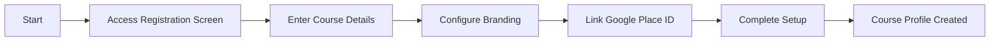
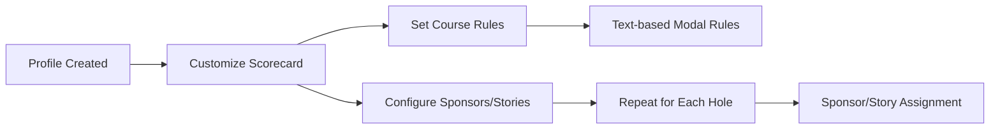
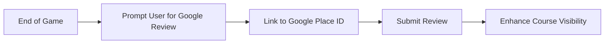

# Course Registration and Profile Creation Process

This document provides a comprehensive overview of the course registration and profile creation process for the Mini Golf Scorecard App. This process allows courses to manage their scorecards, configure branding, set up rules, and include sponsors or stories as desired. This ensures a consistent and recognizable digital presence across the app.

## Registration Process

Courses can register through a dedicated registration screen available on the web. This process is designed to be simple and intuitive, ensuring that courses can quickly establish their presence on the app.

### Steps to Register a Course

1. **Access the Registration Screen**: Navigate to the app's registration page.
2. **Enter Course Details**: Fill in essential information, including course name, location, and contact details.
3. **Branding Configuration**:
   - Upload the course logo.
   - Set primary and secondary colors.
   - Choose typography preferences.
4. **Automatic Google Place ID Linking**: 
   - Input the course address to automatically fetch and link the Google Place ID.
5. **Complete Setup**: Review and submit the details to finalize registration.

### Registration Flow Diagram



## Profile Creation and Customization

Once registered, courses can further customize their profiles. The profile creation process involves setting rules, sponsors, and stories for each hole, creating a personalized and engaging experience for users.

### Customizable Features

- **Scorecards**: Courses can start with a predefined 18-hole scorecard, which they can tailor further.
- **Brand Elements**:
  - Logo
  - Colors
  - Typography
  - Header images on scorecards
- **Course Rules**: Enter text-based rules that users can access through a modal in the app.
- **Sponsors and Stories**:
  - Configure sponsors or stories for each hole using a repeater field.
  - Assign sponsors/stories to specific holes.

### Profile Customization Diagram



## Primary Goal: Enhancing Engagement and Visibility

The app aims to digitize the scorecard while enhancing the visibility and engagement of the courses through Google Reviews. At the end of a game, a modal prompts users to leave a review, linked automatically to the Google Place ID provided during registration.

### User Review Collection Flow



By following these steps and utilizing the provided features, courses can effectively manage their presence on the Mini Golf Scorecard App, offering a robust and personalized digital scorecard experience.
```
