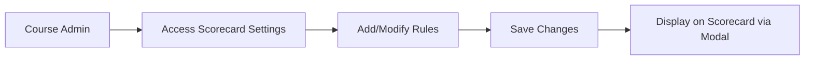
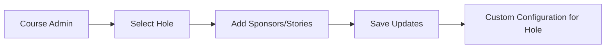
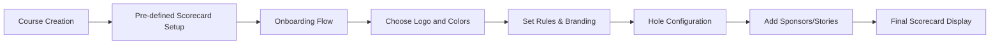

# Scorecard Rules

This documentation provides comprehensive information on how to set up rules and display them on scorecards for the mini golf scorecard app aimed at golf course management.

## Table of Contents

- [Overview](#overview)
- [Setting Up Rules](#setting-up-rules)
- [Displaying Rules on Scorecards](#displaying-rules-on-scorecards)
- [Configuring Sponsors and Stories](#configuring-sponsors-and-stories)
- [Example Workflow](#example-workflow)

## Overview

The mini golf scorecard app allows courses to manage their digital scorecards with flexibility in setting custom rules, incorporating branding elements, and organizing sponsors or stories for each hole. The app is web-based and designed specifically for course management without individual user accounts.

## Setting Up Rules

Golf courses can set up their rules directly within the app. There are no specific restrictions for rule content; therefore, courses have the freedom to define any text-based rules they see fit. These rules will be displayed prominently to ensure players adhere to them during gameplay.

### Steps to Set Up Rules

1. **Access Scorecard Settings:**
   - Navigate to the course management dashboard.
   - Select the "Scorecard Settings" option.

2. **Add or Modify Rules:**
   - Enter the desired text for rules in the provided text area.
   - Use Markdown syntax for formatting if needed (e.g., bullet points, headings).

3. **Save Changes:**
   - Click the "Save" button to apply the changes.

## Displaying Rules on Scorecards

Rules set by the courses will appear in a modal when players view the scorecard. This ensures that players can easily access and read the rules before and during their game.

## Configuring Sponsors and Stories

Each hole on the scorecard can have configurable sponsors or stories. This personalization allows courses to highlight certain aspects of their facilities or acknowledge sponsorships.

### Configuration Steps

1. **Select the Hole:**
   - Use the hole list in the course management dashboard.
   - Choose a hole to configure.

2. **Add Sponsors/Stories:**
   - Use a repeater field to add multiple sponsors or stories for the selected hole.

3. **Save Updates:**
   - Ensure all information is accurately entered before saving.

## Example Workflow

Here's an example workflow illustrating the process from setting rules to displaying them and configuring sponsors.

By following these guidelines, golf courses can efficiently manage and personalize their scorecards, creating a unique digital experience for players that also enhances course marketing and engagement.
