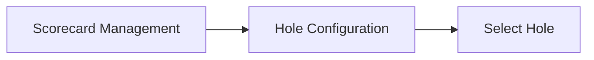
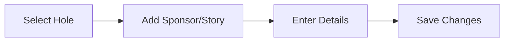
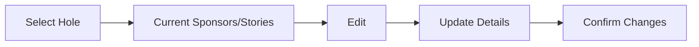
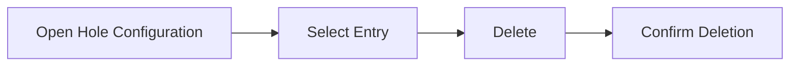

# Sponsor Configuration

This documentation provides detailed instructions for configuring sponsors or stories on each hole within the mini golf scorecard app. This guide will walk you through the steps required to add, edit, and manage content related to sponsors and stories for each hole of a golf course's scorecard.

## Table of Contents

- [Overview](#overview)
- [Hole Configuration](#hole-configuration)
- [Adding Sponsors or Stories](#adding-sponsors-or-stories)
- [Editing Sponsors or Stories](#editing-sponsors-or-stories)
- [Deleting Sponsors or Stories](#deleting-sponsors-or-stories)
- [Visual Configuration](#visual-configuration)
- [Mermaid Diagrams](#mermaid-diagrams)

## Overview

The scorecard app allows golf courses to enhance their scorecards with sponsor information or stories linked to each hole. These customizations help courses personalize their scorecards in line with their branding and marketing strategies. This section is essential for courses wishing to utilize this feature to its full potential.

## Hole Configuration

To begin configuring sponsors or stories, a list of holes is displayed. Each hole can be selected to view or modify associated content.

**Example Steps:**

1. Navigate to the "Scorecard Management" section.
2. Select "Hole Configuration."
3. Choose a hole from the list to configure its details.



## Adding Sponsors or Stories

To add a sponsor or a story to a hole:

1. Select the hole from the list.
2. Click on "Add Sponsor/Story."
3. Enter relevant details in the repeater field—like entity name, description, or story text.
4. Save changes to update the scorecard.

**Data Entry Form:**

```markdown
- Sponsor/Story Name
- Description
- Image/Logo (optional)
- URL link (if applicable)
```



## Editing Sponsors or Stories

To edit existing content:

1. Navigate to the specified hole.
2. In the list of sponsors/stories, click the "Edit" option next to the relevant entry.
3. Update the details as necessary.
4. Confirm changes to save.



## Deleting Sponsors or Stories

If you need to remove a sponsor or story:

1. Open the configuration for the relevant hole.
2. Find the entry you wish to delete and click the "Delete" button.
3. Confirm the deletion to permanently remove the entry.



## Visual Configuration

Courses can upload logos or images associated with sponsors to enhance visual appeal. These should be uploaded directly when configuring sponsor details.

### Supported Formats:

- JPEG
- PNG
- SVG

## Mermaid Diagrams

These diagrams assist in understanding sponsor/story configuration flows and processes. By using these models, courses can efficiently customize their scorecards with sponsors or stories.

---

Ensure that all changes are reviewed and tested in the preview mode to verify how they will appear on the final scorecard. This configuration not only enhances the visibility of sponsors but also enriches the user experience with tailored content specific to each hole.

For further assistance, refer to the related sections within the app's help documentation or contact support.
```
