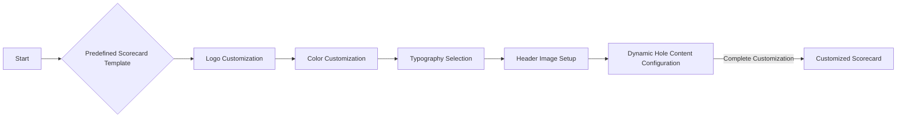
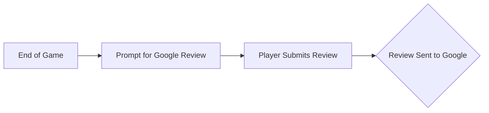

# Goals of the Mini Golf Scorecard App

## Project Overview

The Mini Golf Scorecard App aims to revolutionize the way mini golf courses manage and present their scorecards by transitioning them from paper to a digital platform. This web-based application will enable course managers to customize their scorecards with unique branding elements, integrate sponsorships and stories, and encourage players to leave Google Reviews for an enhanced digital experience.

## Primary Goals

### 1. Digital Scorecard Management

- **Custom Branding**
  - Courses can customize their scorecards with logos, color schemes, typography, and header images.

- **Configurable Course Rules**
  - A feature allowing courses to set text-based rules which players can view in a modal. 

- **Dynamic Hole Content**
  - Manage content for each hole, including sponsors or stories, via a flexible repeater field system.

- **Predefined Scorecard Templates**
  - Onboarding courses will begin with a predefined scorecard template typically consisting of 18 holes. The onboarding flow will guide them through customization, including setting logo and branding options.



### 2. Review Collection System

- **Google Review Integration**
  - Courses can link their location through a Google Place ID during onboarding, enabling an automatic prompt at the end of each game that asks players to leave a Google Review.



## Functionality Highlights

- **Course Management Interface**
  - A streamlined registration screen for courses to create profiles and access scorecard customization options.

- **Seamless User Engagement**
  - No need for personal accounts; the focus remains entirely on course facilitation without personal user data management.

- **Sponsor and Story Integration**
  - Add sponsors and stories associated with each hole through a user-friendly repeater field, enhancing marketing potential and providing unique narratives for players.

## Future Prospects

While the current focus is on developing a robust digital scorecard and review system, potential future enhancements could include features such as analytics dashboards for course managers and expanded customization options. There is no strict timeline, allowing for iterative development and improvements based on user feedback and emerging needs.
```
