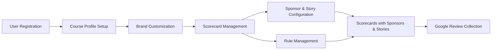

# Mini Golf Scorecard App - Project Overview

## Project Description

The Mini Golf Scorecard App is designed to streamline the management of scorecards for mini golf courses, while allowing courses to maintain and enhance their brand through customizable elements. This web-based app will enable courses to manage their scorecards, complete with custom branding, sponsor stories, and dynamic rule display, all without the need for personal user accounts. The primary focus is on making the scorecard digital and facilitating the collection of Google Reviews.

## Key Features and Functionalities

### Course Customization

- **Branding Elements:**
  - Customizable logos, colors, typography, and header images on scorecards.

- **Scorecard Management:**
  - Default scorecard templates provided with 18 holes.
  - Onboarding flow for uploading logos and selecting color schemes.

### Configuration Systems

- **Rules Management:**
  - Courses can define text-based rules, displayed via modal pop-ups.

- **Sponsors and Stories:**
  - System to add and configure sponsors or stories for specific holes using a repeater field structure.

### User Interaction

- **Review System:**
  - Integration with Google Places to gather Google Reviews post-game.
  - Automatic linkage to course's Google Place ID based on address input during onboarding.

## Technology Stack

- **Platform:** Web-based application.
- **External Systems:** Direct integration with Google Places for review collection.
- **Database:** Standalone, as there are no integrations with existing external databases.

## Registration and Profile Setup

Courses can register and create profiles using a built-in registration screen. This flow includes options for setting up initial customization through an intuitive onboarding sequence.

## Architecture Overview



## Usage Flow Example

1. **Course Registration:**
   - Initiate registration.
   - Customized onboarding to choose branding elements.

2. **Scorecard Creation:**
   - Use predefined template.
   - Customize using branding choices.

3. **Game Execution:**
   - Players interact with digital scorecard.
   - Experiences sponsors and stories with tailored information.

4. **Review Process:**
   - Complete game feedback loop.
   - Trigger Google Review request.

## Goal and Intent

The app aims to improve the digital experience of mini golf scorecards primarily for course management, facilitate the branding and marketing for golf courses, and streamline the review collection process to enhance online presence.

## Timeline

There are no specific timelines set for the design or development phases, offering flexibility in execution to refine and perfect the app’s functionalities.
```
