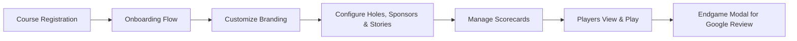
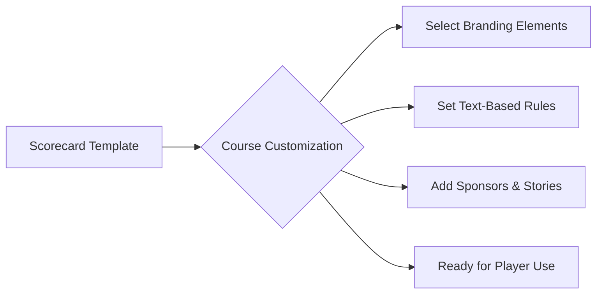

# Overview of the Mini Golf Scorecard App Project

## Project Summary

The Mini Golf Scorecard App is a web-based application designed to revolutionize the way mini golf courses manage and present their scorecards. This application empowers each course to enhance brand visibility by creating custom scorecards integrated with their unique logos, colors, and other brand elements. Additionally, the app encourages user reviews on Google to enhance course marketing.

## Core Features

- **Course Customization**
  - Courses can personalize their scorecards with specific branding elements such as logos, colors, typography, and header images.
  - Ability to set custom text-based rules to guide players, displayed in modals.

- **Dynamic Scorecard Management**
  - Predefined scorecard templates with the standard 18 holes provided upon course creation.
  - Innovative onboarding flow to assist course managers in customizing visual aspects and linking to Google Places.

- **Sponsor and Story Integration**
  - Courses can enhance each hole with sponsor information or course stories using a flexible repeater field system.
  - Each hole can be customized to include varied configurations of sponsors and stories.

- **Feedback Mechanism**
  - At the game's end, a pop-up modal prompts players to submit reviews on Google, linked directly through Google Place IDs.

## Architecture and Workflow

### User Interaction Flow

### Scorecard Management Process

## Technical Specifications

- **Platform:** Web-based application, accessible on mobile and desktop devices.
- **User Accounts:** Focused solely on course management with no personal user accounts.
- **Data Management:** No integration with external systems or databases; internal data management within the app.
- **Design Flexibility:** Courses have access to a predefined scorecard template which they can customize extensively.

## Project Goals

1. **Digitization of Scorecards:** Transition traditional scorecards to a modern, digital format.
2. **Enhanced Marketing:** Facilitate the collection of user-generated reviews on Google to improve course visibility.
3. **Course Autonomy:** Allow courses to self-manage their branding and promotional content directly through the app.

## Conclusion

The Mini Golf Scorecard App stands as a tool tailored for courses to efficiently manage their digital presence and customer interactions. By focusing on customization and seamless integration with Google Reviews, the app not only streamlines golf management but also contributes to marketing efforts, ultimately enhancing the user experience.
