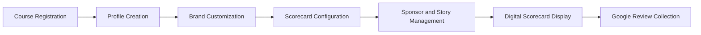
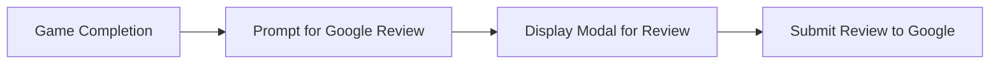

# Mini Golf Scorecard App Project Overview

## Project Description

The Mini Golf Scorecard App is an innovative digital solution tailored for golf courses to manage their scorecards. This web app enables courses to customize their digital scorecards with branding elements such as logos, colors, and typography. It provides a platform for courses to set specific rules, manage sponsorships, and tell stories about each hole. The application aims to enhance course marketing through digital engagement and streamlining the Google Reviews collection process.

## Features

- **Course Management**
  - Courses can register and create profiles using a dedicated registration screen.
  - Courses can customize branding with logos, colors, typography, and a header image.

- **Scorecard Customization**
  - Predefined templates for scorecards with 18 holes.
  - Options to configure text-based rules for each scorecard.
  - System for adding sponsors and stories for each hole.

- **User Experience**
  - No personal user accounts are required.
  - Onboarding flow to set up branding and Google Place ID for review collection.
  - Modal popup at the end of the game to prompt Google Reviews.

## System Architecture



## Course Customization Features

- **Branding Elements**
  - Logo
  - Colors
  - Typography
  - Header image on the scorecard

- **Scorecard Rules**
  - Configurable text-based rules displayed in a modal window.

- **Sponsor and Story Configuration**
  - Add holes and assign sponsors or stories using a repeater field system.

## Review Collection Workflow



## Goals

1. **Digital Scorecard Implementation**
   - Transition traditional scorecards to a digital format enhancing accessibility and usability.

2. **Course Branding Enhancement**
   - Allow courses to showcase their unique identity through customizable digital scorecards.

3. **Review Collection Efficiency**
   - Facilitate seamless Google Reviews collection as part of the app's features to bolster course marketing.

## Development Considerations

- The app will be available exclusively as a web application.
- No external system integrations or databases are required at this stage.
- Developers should focus on a flexible and user-friendly UI for course administrators.
- There are no strict timelines set for design or development phases.

## Conclusion

The Mini Golf Scorecard App is poised to revolutionize how golf courses manage and present their scorecards to players. With comprehensive customization features, potential for increased marketing through reviews, and a user-focused design, this app stands to offer significant value to mini golf courses looking to enter the digital age.
```
