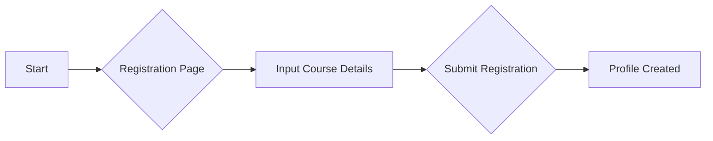
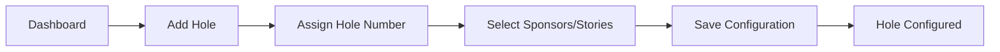
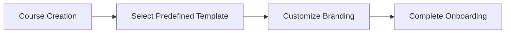
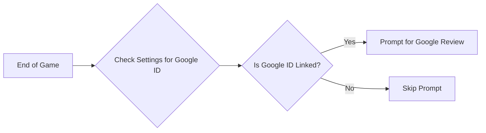

# Web-Based Platform Requirements

This document outlines the requirements and design specifications for the web-based platform of our mini golf scorecard app. This platform will enable golf courses to manage their scorecards, customize branding, input course-specific rules, and configure sponsor and story details for each hole.

## Table of Contents

1. [Course Registration](#course-registration)
2. [Customizable Branding Elements](#customizable-branding-elements)
3. [Scorecard Rule Configuration](#scorecard-rule-configuration)
4. [Hole Sponsorship and Story Configuration](#hole-sponsorship-and-story-configuration)
5. [Predefined Scorecard Templates](#predefined-scorecard-templates)
6. [Google Reviews Integration](#google-reviews-integration)

## Course Registration

Courses will register and create profiles through a simple registration screen. This process is strictly for course management, as no personal user accounts are required.

### Registration Flow



## Customizable Branding Elements

Courses will have the ability to customize various branding elements to maintain their identity. Elements include:

- **Logo**: Upload a custom logo.
- **Colors**: Select primary and secondary colors.
- **Typography**: Choose fonts that reflect the course's aesthetic.
- **Header Image**: Add a header image to the scorecard.

## Scorecard Rule Configuration

Courses can define text-based rules that will appear in a modal on the scorecard. There are no specific restrictions on these rules.

## Hole Sponsorship and Story Configuration

Each hole can have customizable sponsors and stories. Courses will add holes and associate each with sponsors or stories using a repeater field.

### Configuration System Flow



## Predefined Scorecard Templates

When a course creates a profile, they will be provided with a predefined 18-hole scorecard template. An onboarding flow will assist them in choosing logos, colors, and other customizable options.

### Onboarding Flow



## Google Reviews Integration

One of the primary goals of the application includes collecting Google Reviews. At the end of the game, a modal will pop-up encouraging users to leave a review.

### Google Review Workflow


```
